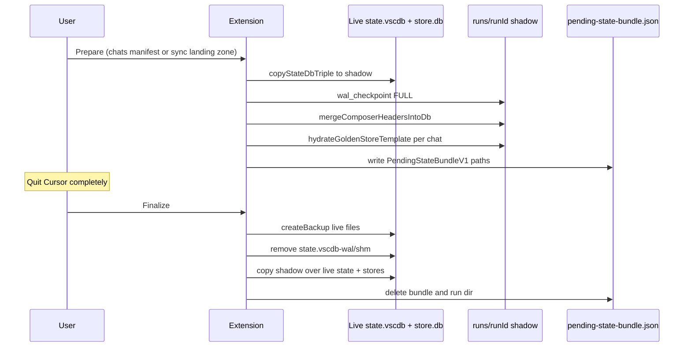

# Backup, overwrite, and restore risks (full-file chat persistence)

Research for cross-version full-file sync of Cursor chat persistence. Extension code treats SQLite files as opaque byte blobs for `store.db` and uses structured merge for `state.vscdb` composer keys.

## Backup surfaces

| Surface | Live path (Linux) | What gets captured | Extension entry points |
|---------|-------------------|--------------------|-------------------------|
| Per-chat store | `~/.cursor/chats/<workspaceKey>/<conversationId>/store.db` | Entire file (base64 in JSON bundles; raw copy in pending reconciliation) | `saveChat` / `loadChat`, transcript export v2 `kind: "store"`, `PendingStateBundleV1.storeReplacements` |
| Global composer state | `~/.config/Cursor/User/globalStorage/state.vscdb` | `composer.composerHeaders`, `composer.composerData` (JSON in `ItemTable`) | `saveChat` sidebar snapshot; additive merge on load/import; full-file replace on finalize |
| Workspace-scoped state | `~/.config/Cursor/User/workspaceStorage/<folderId>/state.vscdb` | Same ItemTable keys when `stateTarget: "workspace"` | `resolveLiveStateDbPath`, chats manifest / sync manifest |
| Agent transcripts | `~/.cursor/projects/<project>/agent-transcripts/<conversationId>/*.jsonl` | Exact UTF-8 bytes + checksum | Chat bundle `transcriptFiles`; gist transcript manifests |
| Extension rollback snapshots | `<extension globalStorage>/backups/<timestamp>/` | Copy of each target file that existed before overwrite | `createBackup` in `rollback.ts` (max 3 dirs retained) |
| Pending reconciliation run | `<extension globalStorage>/state-reconciliation/runs/<runId>/` | Shadow `state.vscdb` (+ `-wal`/`-shm` if present), shadow `store.db` per chat | `executePrepareStateReconciliation`, `SyncEngine.prepare` |
| Pending bundle pointer | `<extension globalStorage>/state-reconciliation/pending-state-bundle.json` | JSON manifest of live vs shadow paths | `PendingStateBundleV1` |

**Chat bundle (`ChatBundle`, schemaVersion 1)** — `src/chat-persistence.ts`: optional `storeSnapshot` (full `store.db` bytes), optional `sidebarSnapshot` (parsed composer keys), `transcriptFiles` with per-file checksums. Save warns and continues if `store.db` or `state.vscdb` is missing or locked.

**Chats manifest / state reconciliation** — `src/state-reconciliation.ts`: does not backup live files at prepare time; builds shadow copies under `runs/<runId>/`. Finalize backs up live targets immediately before replace.

**Golden template path** — When no native `store.db` exists to copy, `hydrateGoldenStoreTemplate` copies `resources/golden-chat-store.template.db` and runs SQL updates (`src/store-template-hydrate.ts`). That is synthesis, not restoration of a captured blob.

## Overwrite mechanics

### Full-file replace (store.db)

- **Local chat load** (`loadChat`): `fs.writeFile` to `~/.cursor/chats/<targetWorkspaceKey>/<conversationId>/store.db` after checksum verify; `createBackup` only if destination already exists.
- **Transcript gist import** (`applyRestoreOperations` in `transcripts.ts`): atomic `writeFile` to `.tmp` then `rename` for transcripts; store artifacts use the same pattern to mapped chats paths.
- **Finalize pending reconciliation**: `replaceFileWithRetries` copies shadow → live for each `storeReplacements` entry; no WAL sidecar handling for `store.db` (only main file).

### Full-file replace (state.vscdb)

- **Finalize** (`executeFinalizeStateReconciliation`): backs up live `stateVscdbLive`, deletes `${live}-wal` and `${live}-shm`, copies shadow main over live, retries up to 5 times with backoff.
- **Prepare**: `copyStateDbTriple` copies main + optional `-wal` + `-shm` to shadow; `runWalCheckpointFull` on shadow (`PRAGMA wal_checkpoint(FULL)`).

### Merge-in-place (state.vscdb, no full replace)

- **Chat bundle load**, **gist import**, **transcript import**: read existing `composer.composerHeaders` / `composer.composerData`, merge via `mergeComposerHeadersChain` / `mergeComposerDataAdditive`, run `BEGIN IMMEDIATE` SQL script via `runSqliteScript`. On failure, `rollbackFromBackup` restores the single DB file from extension backup (not WAL triple).

### Rollback semantics (`src/rollback.ts`)

- Backup: `copyFile` live → `globalStorage/backups/<iso-timestamp>/<path-with-slashes-as-dashes>`.
- Missing destination: no backup row (new file).
- Rollback: copy backup → live per entry; failures logged, not re-thrown.
- `pruneOldBackups`: keeps newest 3 backup directories only; no UI restore command.

## Version / schema drift

| Layer | Version signal | Drift risk |
|-------|----------------|------------|
| `store.db` | `PRAGMA user_version` (golden template = 1) | `assertTemplateLayout` fails hydrate if version or `meta`/`blobs` layout changes; hydration warning: "Cursor upgrades may change store.db layout" |
| `ChatBundle` | `schemaVersion: 1`, `type: "chat-persistence"` | Load rejects other versions |
| Transcript manifest | v1 (transcripts only) / v2 (artifacts + store metadata) | v2 requires `sourceWorkspaceKey` for store restore |
| `PendingStateBundleV1` | `schemaVersion: 1`, records `goldenStoreTemplateVersion` | Finalize rejects unsupported bundle schema; does not re-validate live Cursor version at finalize |
| Composer JSON | Implicit Cursor UI contract | Headers need `type: "head"` (`composer-merge.ts`); timestamps as epoch ms; `composerId` must match folder / `meta.agentId` |
| `state.vscdb` | VS Code / Cursor internal | ItemTable keys beyond composer.* may reference chats; full replace may drop unrelated keys if shadow was built from stale copy |

**Cross-version full-file `store.db`**: Extension assumes SQLite file is valid if checksum matches. No migration step on import. If Cursor adds tables, columns, encryption, or changes BLOB encoding, blind restore can yield unreadable UI or silent ignore.

**Cross-version `state.vscdb`**: Full replace from an old shadow after upgrade may downgrade global state. Merge-only paths are safer for unrelated keys but still assume JSON shape compatibility.

## File locking and WAL

| File | WAL handling in extension | Risk while Cursor running |
|------|---------------------------|---------------------------|
| `state.vscdb` | Copy triple on prepare; checkpoint shadow; strip `-wal`/`-shm` on finalize before replace | Read/write via `sqlite3` CLI subprocess; `isExecFileTimeoutError` → skip or fail merge; prepare may fail shadow copy |
| `store.db` | Template sets `journal_mode = WAL` in golden SQL; live restore writes main file only | No checkpoint; orphaned `-wal`/`-shm` beside live store possible if OS/Cursor had DB open |
| Transcripts | Plain files | Lower risk; timeout on slow paths |

Operational requirement repeated in UI: **fully quit Cursor (all windows)** before finalize pending reconciliation. Chat load suggests reload window after sidebar merge.

`replaceFileWithRetries` (400ms × attempt backoff) addresses transient lock errors, not active Cursor holding the DB.

## Safe restore procedure

1. **Quit Cursor** completely before replacing `state.vscdb` or bulk `store.db` via pending finalize.
2. **Prefer two-phase reconciliation** for manifest-driven imports: Prepare → quit → Finalize (`executePrepareStateReconciliation` / `executeFinalizeStateReconciliation`). Shadow work avoids touching live DBs during merge SQL.
3. **Verify checksums** on bundle/gist artifacts before write; extension skips mismatched store/transcript bytes.
4. **Map workspace keys explicitly**: `sourceWorkspaceKey` → local `~/.cursor/chats/<key>`; validate with `validateWorkspaceKeysForImport` where used.
5. **Align join keys**: `composerId` === conversation folder name === `meta.agentId`; restore composer headers with `type: "head"`.
6. **Restore all layers** for visible sidebar chat: `store.db` + `composer.composerHeaders` (and often `composer.composerData`) + transcripts; missing layer → degraded visibility (tree view fallback per README).
7. **Reload window** after state merge if chats do not appear.
8. **Rely on automatic backup + rollback** on finalize failure; retry only after quit if rollback occurred.

### Safe constraints (summary)

| Constraint | Rationale |
|------------|-----------|
| Cursor not running for finalize / full `state.vscdb` replace | Avoid lock corruption and partial WAL state |
| Checksum-valid opaque `store.db` bytes | Integrity only; not schema compatibility |
| Correct `workspaceKey` under `~/.cursor/chats/` | Wrong key → store on disk but invisible in UI |
| Composer header merge with `type: "head"` | Cursor ignores entries without it |
| `composerId` matches conversation id | Join key across layers |
| Use shadow + pending bundle for multi-file atomic intent | Single finalize replaces state + all listed stores |
| Keep extension backups in mind (last 3) | Only automatic rollback on failure, not long-term archive |

## Unsafe operations

| Operation | Why unsafe |
|-----------|------------|
| Copy `store.db` only, without sidebar/state merge | Sidebar pointers missing or stale; chat may not list |
| Merge sidebar only, without `store.db` | Header row without message blobs |
| Full `state.vscdb` replace while Cursor is running | Lock errors, corruption, or lost WAL pages |
| Copy `state.vscdb` main file without `-wal`/`-shm` and without checkpoint | Incomplete snapshot; finalize mitigates on shadow, not on ad-hoc copies |
| Restore `store.db` without deleting stale `store.db-wal` / `-shm` | Possible inconsistent reads if WAL out of sync with main |
| Assume `workspaceKey` equals `workspaceStorage` folder id | Different namespaces; mapping is manual |
| Blind cross-major Cursor upgrade then old full-file restore | Schema / encryption / key drift |
| Rely on golden template hydration for faithful history | Best-effort message reconstruction, not byte-accurate backup |
| Manual edits to `composer.composerHeaders` without merge helpers | Duplicate or invalid JSON; broken sidebar |
| Expect UI backup restore | Extension does not expose restore-from-backup command |
| Import with wrong project mapping | Transcripts under wrong `agent-transcripts` tree |
| Skip reload after successful state merge | Stale in-memory composer state |

## Hypothesis verdict (cross-version full-file restore)

**Partially supported, with strong conditions.**

Copying intact `store.db` and matching `state.vscdb` composer entries can revive chats **when**:

- Cursor’s on-disk layout for `meta`/`blobs` and ItemTable composer JSON is unchanged across versions.
- IDs remain compatible (`composerId`, `workspaceKey`, folder names).
- WAL sidecars are not left inconsistent (prefer quit-Cursor finalize pattern for state; for store, prefer whole-file replace while Cursor is off).
- All three layers (store, state composer keys, transcripts) are consistent.

**Not supported** as a general guarantee: extension code explicitly flags golden hydration and template version as best-effort and records `goldenStoreTemplateVersion` in pending bundles without enforcing runtime Cursor version. Checksum validation proves byte fidelity, not that Cursor will still parse those bytes after an upgrade.

**Safer than blind full-file restore**: pending-state-bundle flow (shadow + WAL checkpoint + quit + finalize with backup/rollback), and additive composer merge while Cursor is open for sidebar-only updates.

## Pending-state-bundle flow

`PendingStateBundleV1` fields (`state-reconciliation.ts`):

- `stateVscdbLive` / `stateVscdbShadow`
- `storeReplacements[]`: `{ livePath, shadowPath }`
- `goldenStoreTemplateVersion`, `goldenTemplateNote` (provenance for hydrated stores)
- `runId`, `createdAt`

On finalize failure: `rollbackFromBackup` restores pre-replace live files; user must quit Cursor and retry.

`notifyPendingStateBundleIfAny` warns on extension activation if a pending bundle exists.

## Sources

| Topic | Location |
|-------|----------|
| Bootstrap paths and risks | `.orchestrate/cursor-chat-persistence/bootstrap-reference.md` |
| Chat bundle save/load, checksums, store write | `src/chat-persistence.ts` |
| Pending bundle prepare/finalize, WAL strip | `src/state-reconciliation.ts` |
| Backup / rollback / prune | `src/rollback.ts` |
| Golden template version, hydrate warnings | `src/store-template-hydrate.ts`, `resources/golden-store-template.sql` |
| State DB triple copy, WAL checkpoint | `src/sync-engine-ops.ts` |
| SyncEngine landing-zone prepare | `src/sync-engine.ts` |
| Composer merge, `type: "head"` | `src/composer-merge.ts` |
| Transcript restore, preflight, timeouts | `src/transcripts.ts` |
| Bundle format tests | `tests/chat-persistence.test.ts` |
| User-facing restore expectations | `README.md` (Agent Transcript Export and Import, Recovery) |
