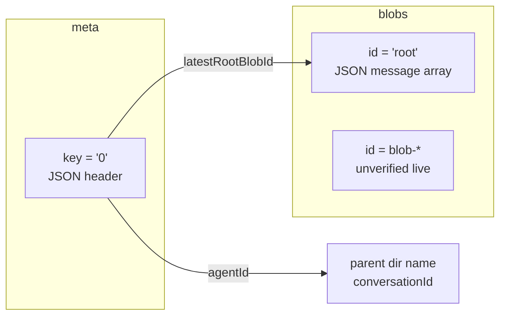

# Cursor `store.db` layout (explore)

Per-conversation SQLite database under `~/.cursor/chats/<workspaceKey>/<conversationId>/store.db`. This document reverse-engineers tables, keys, blob graph, versioning, and encryption boundaries from repo prior art and the bundled golden template. **Live inspection gap:** this environment has no `~/.cursor/chats/**/store.db` files; live Cursor behavior beyond the golden template is flagged under Unknowns.

## Schema

### File location and naming

| Component | Value |
|-----------|--------|
| Root | `~/.cursor/chats/` (`resolveChatsRoot()` in `src/transcripts.ts`) |
| Per conversation | `<workspaceKey>/<conversationId>/store.db` |
| Discovery | `findStoreDbForConversation()` scans every workspace subdirectory for `<conversationId>/store.db` |

`workspaceKey` is an opaque directory name Cursor creates per workspace (not necessarily equal to `workspaceStorage` folder id). `conversationId` is the UUID folder name; bootstrap also calls this `agentFolder` / `composerId`.

### SQLite layout (observed)

Source: `resources/golden-store-template.sql`, `resources/golden-chat-store.template.db` (inspected with sqlite3 3.45.1).

| Setting | Value |
|---------|--------|
| `PRAGMA user_version` | `1` (`GOLDEN_STORE_TEMPLATE_VERSION` in `src/store-template-hydrate.ts`) |
| `PRAGMA journal_mode` | `wal` |
| `PRAGMA encoding` | `UTF-8` |
| Page size | 4096 |

**Tables (only two):**

```sql
CREATE TABLE meta (
  key TEXT PRIMARY KEY,
  value BLOB NOT NULL
);

CREATE TABLE blobs (
  id TEXT PRIMARY KEY,
  value BLOB NOT NULL
);
```

No other tables, views, or triggers appear in `sqlite_master` for the golden file.

### `meta` table

| Key (sample) | Value shape | Purpose (inferred) |
|--------------|-------------|-------------------|
| `'0'` | UTF-8 JSON stored as BLOB | Conversation header / pointer to root message blob |

Observed JSON fields (golden template and hydration code):

```json
{
  "agentId": "<uuid>",
  "latestRootBlobId": "root",
  "name": "<display title>",
  "mode": "default",
  "createdAt": <number, epoch ms>
}
```

- `agentId`: set to `chat_id` / `conversationId` on hydrate (`src/store-template-hydrate.ts`).
- `latestRootBlobId`: blob id in `blobs` table for the message list (golden uses `"root"`).
- `mode`: always `"default"` in extension-generated stores.
- `createdAt`: milliseconds from manifest/chat timestamp.

**Other `meta` keys:** not present in golden template or extension code. Live Cursor may add keys; unverified.

### `blobs` table

| `id` (sample) | Value shape | Purpose (inferred) |
|---------------|-------------|-------------------|
| `'root'` | UTF-8 JSON array as BLOB | Serialized message list for the conversation |

Golden / hydrated message element shape:

```json
{
  "role": "user" | "assistant" | "tool",
  "content": [
    { "type": "text", "text": "<string>" }
  ]
}
```

Hydration builds a **single** array in blob `root` with one object per manifest message (`buildCursorMessageParts`).

### Versioning

- Layout version is **`PRAGMA user_version = 1`** only signal in-repo.
- Extension asserts `user_version === 1` before hydrate (`assertTemplateLayout`).
- Pending bundles record `goldenStoreTemplateVersion: 1` (`src/state-reconciliation.ts`, `src/sync-engine.ts`).
- Bump requires editing `golden-store-template.sql`, regenerating `golden-chat-store.template.db`, and `GOLDEN_STORE_TEMPLATE_VERSION` (`resources/README-golden.txt`).

### Sidecar files

- Golden DB is created with WAL mode; after writes, `-wal` / `-shm` may exist beside `store.db`.
- Extension **finalize** replaces `store.db` via whole-file copy (`replaceFileWithRetries`); it does **not** copy or delete `store.db-wal` / `store.db-shm` (unlike `state.vscdb`, where WAL/SHM are removed before replace). Risk: stale WAL after restore if Cursor had been using the DB.

## Keys and blob graph



| Layer | Identifier | Points to |
|-------|------------|-----------|
| Filesystem | `~/.cursor/chats/<workspaceKey>/<conversationId>/` | Directory containing `store.db` |
| `meta['0'].agentId` | UUID string | Same as `conversationId` / `composerId` (extension invariant) |
| `meta['0'].latestRootBlobId` | string | `blobs.id` row holding message payload |
| `blobs['root'].value` | JSON array | Ordered chat messages (extension model) |

**Extension-supported graph:** one meta row (`'0'`) and one blob row (`'root'`). Sync/import either copies a full `store.db` from a landing zone or hydrates this minimal graph from the golden template.

**Fixture alternate model** (`tests/fixtures/transcripts-bundle-v2/store-snapshot.json`): documents `latestRootBlobId: "blob-001"` and blob entries with `kind: "message"` and `payload.parts` (reasoning, tool-result). That JSON is **not** the on-disk SQLite shape; it is a conceptual/export fixture. Do not assume live Cursor uses `blob-001` ids without live samples.

**Sample key patterns (golden + tests):**

| Table | Key / id | Notes |
|-------|----------|--------|
| meta | `0` | Sole meta key in golden |
| blobs | `root` | Sole blob id in golden; `latestRootBlobId` matches |
| blobs | `blob-*` | In fixture only; live pattern unknown |

## Join keys to composerId

Alignment required for sidebar visibility (`src/chat-id-sync.ts`):

| Layer | Field | Must equal |
|-------|-------|------------|
| Directory | `~/.cursor/chats/<ws>/<conversationId>/` | `conversationId` |
| `meta` JSON | `agentId` | `conversationId` |
| `state.vscdb` ItemTable | `composer.composerHeaders` → `allComposers[].composerId` | `conversationId` |
| Manifest / bundle | `chat_id`, `conversationId` | same UUID |
| Agent transcripts | `~/.cursor/projects/<project>/agent-transcripts/<conversationId>/` | same UUID (parallel transcript layer) |

`workspaceKey` must match an existing directory under `~/.cursor/chats/` for import validation (`validateWorkspaceKeysForImport`). It is **independent** of project folder name under `~/.cursor/projects/`.

Extension does **not** read `composerId` from inside `store.db` when locating files; it uses directory name and sets `agentId` on hydrate to match.

## Encrypted vs plaintext

| Data | Location | Status | Evidence |
|------|----------|--------|----------|
| `meta.value` | BLOB column | **Plaintext JSON** (UTF-8 in BLOB) | Golden hex decodes to `{"agentId":...}`; hydration uses `CAST('<json>' AS BLOB)`; tests `CAST(value AS TEXT)` and grep JSON substrings |
| `blobs.value` | BLOB column | **Plaintext JSON** | Same; golden root blob is readable `[{"role":"user",...}]` |
| Whole `store.db` file | Filesystem | **Opaque binary SQLite** (not encrypted at file level in template) | Standard SQLite header `SQLite format 3`; export uses raw bytes + base64 (`src/chat-persistence.ts`, `src/transcripts.ts`) |
| Extension bundle | JSON | Base64 wrap of raw DB bytes | Checksum over decoded bytes; no decryption step |

**No encryption** is implemented or assumed in extension read/write paths for `store.db`. There is no decrypt API, no key derivation, and no non-JSON blob parsing.

**Live Cursor:** Could theoretically encrypt BLOB payloads in newer builds; **not observed** in this repo or on this VM (no live DBs). Verifier should run on a machine with active chats:

```bash
sqlite3 ~/.cursor/chats/*/*/store.db "SELECT key, substr(CAST(value AS TEXT),1,80) FROM meta;"
sqlite3 ~/.cursor/chats/*/*/store.db "SELECT id, substr(CAST(value AS TEXT),1,80) FROM blobs LIMIT 5;"
```

If `CAST(value AS TEXT)` is not valid UTF-8 JSON, treat as encrypted or binary-encoded.

## Unknowns

1. **Live `meta` keys other than `'0'`** — extension only documents `'0'`.
2. **Multi-blob chains** — whether Cursor uses multiple `blobs` rows linked from `latestRootBlobId` (fixture suggests yes; golden template uses single `root` only).
3. **Rich message schema** — tool calls, reasoning blocks, attachments in live blobs vs extension’s simplified `{ role, content: [{ type: "text", text }] }`.
4. **`mode` values** beyond `"default"`.
5. **File-level encryption** or SQLCipher — not indicated by golden DB; needs live file inspection.
6. **Other files in conversation directory** — only `store.db` referenced in code; live dirs may contain more.
7. **WAL handling on store replace** — finalize does not checkpoint or remove `store.db-wal`/`shm`.
8. **Cursor version drift** — `user_version` may change in future Cursor releases without extension update.

## Sources

| Source | Use |
|--------|-----|
| `.orchestrate/cursor-chat-persistence/bootstrap-reference.md` | Paths, hypothesis, join keys |
| `resources/golden-store-template.sql` | Canonical DDL + seed rows |
| `resources/golden-chat-store.template.db` | sqlite3 inspection (user_version, schema, sample values) |
| `resources/README-golden.txt` | Regeneration and version bump procedure |
| `src/store-template-hydrate.ts` | meta/blob field names, hydrate SQL, version assert |
| `src/transcripts.ts` (`resolveChatsRoot`, `findStoreDbForConversation`, export store artifact) | Paths, binary export |
| `src/chat-persistence.ts` | Full-file save/restore, workspace mapping |
| `src/chat-id-sync.ts` | composerId / workspaceKey invariants |
| `src/state-reconciliation.ts`, `src/sync-engine.ts` | Shadow hydrate, whole-file replace |
| `tests/store-template-hydrate.test.ts` | Plaintext JSON round-trip after hydrate |
| `tests/fixtures/transcripts-bundle-v2/store-snapshot.json` | Non-SQL conceptual blob model (fidelity target) |
| `tests/chat-persistence.test.ts` | base64 whole-file round-trip |

**Live inspection:** attempted `find ~/.cursor/chats -name store.db` on worker VM — **no files** (exit 2 / empty). All schema conclusions above derive from golden template + extension behavior unless noted as unknown.
