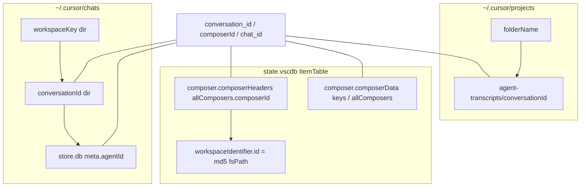

# Workspace mapping: `workspaceKey`, workspaceStorage, and project paths

Read-only reverse-engineering from Cursor Sync extension sources and bootstrap notes. **No live Cursor data** was available on the research VM (`~/.cursor/chats`, `~/.config/Cursor/User/workspaceStorage`, and `~/.cursor/projects` were absent), so correlations involving `workspace.json` are documented as procedures and gaps, not measured joins.

## Identifier types

| Identifier | Where it lives | Role in chat persistence |
|------------|----------------|---------------------------|
| **workspaceKey** | `~/.cursor/chats/<workspaceKey>/` | Groups all `store.db` files for one workspace. Each chat is `<workspaceKey>/<conversationId>/store.db`. |
| **workspaceStorageFolderId** | `~/.config/Cursor/User/workspaceStorage/<workspaceStorageFolderId>/` (Linux) | VS Code/Cursor per-workspace storage folder name. Contains `workspace.json` and `state.vscdb` when `stateTarget` is workspace-scoped. |
| **conversation_id** / **composerId** / **chat_id** | UUID (same value across layers) | Primary chat identity: sidebar pointer, chats folder name, `store.db` parent dir, `meta.agentId`, transcript dirs. |
| **projectKey** / **folderName** | `~/.cursor/projects/<folderName>/` | Agent transcript tree (`agent-transcripts/<conversationId>/`). **Different namespace** from `workspaceKey`. |
| **workspaceIdentifier.id** | Inside `composer.composerHeaders` entries (JSON) | `md5(workspaceFolderFsPath)` stamped on import so sidebar entries match the **currently open** folder—not the chats or workspaceStorage ids. |

### workspaceKey vs workspaceStorageFolderId

These are **distinct fields** in manifests and code:

- `workspaceKey` → chats filesystem layout only.
- `workspaceStorageFolderId` → which `state.vscdb` to read/write when `stateTarget === "workspace"`.

The extension never assumes they are equal. `chats-manifest.ts` and `sync-manifest.ts` require both independently (workspace target mandates `workspaceStorageFolderId`; `workspace_key` / `workspaceKey` is always required for chats paths).

### workspaceKey vs project folderName

Also **not assumed equal**. UI copy for legacy store restore states explicitly: *"Chats workspace hash is not the Cursor project folder name"* (`resolveV1ImportStoreChatsWorkspaceKey` in `transcripts.ts`). Project folders use a separate naming scheme (`humanLabel` strips a trailing 40- or 8-character hash segment for display).

### Does workspaceKey equal any hash?

**Not established in-repo.** Nothing computes `workspaceKey` from `workspaceStorageFolderId`, project path, or `md5(fsPath)`. The extension treats `workspaceKey` as an **opaque directory name** Cursor creates under `~/.cursor/chats/` when Agent chat is used. `workspaceIdentifier.id` uses `md5(fsPath)` for sidebar JSON only—that value is documented separately and is not written into the chats path layout by this extension.

## Mapping algorithm

### What Cursor does (observable contract)

1. User opens a workspace and uses Agent chat.
2. Cursor creates `~/.cursor/chats/<workspaceKey>/` (if missing) and `.../<conversationId>/store.db` per thread.
3. Separately, VS Code maintains `workspaceStorage/<workspaceStorageFolderId>/` with `workspace.json` pointing at the folder URI and `state.vscdb` holding `composer.composerHeaders` / `composer.composerData`.
4. Agent transcripts land under `~/.cursor/projects/<encoded-path-and-hash>/agent-transcripts/<conversationId>/`.

The extension does **not** reverse-engineer step 2’s string; it **discovers** existing keys.

### Extension discovery and validation

| Function | Module | Behavior |
|----------|--------|----------|
| `listWorkspaceKeysUnderChatsRoot` | `chat-id-sync.ts` | `readdir` of `~/.cursor/chats/`; returns directory names. |
| `listChatsWorkspaceKeys` | `transcripts.ts` | Same scan (duplicate helper for import flow). |
| `validateWorkspaceKeysForImport` | `chat-id-sync.ts` | Every manifest `workspace_key` must exist under chats (or chats root empty → warn-only). |
| `findStoreDbForConversation` | `transcripts.ts` | Linear scan of **all** workspace keys for `.../<conversationId>/store.db`. |
| `findProjectMatchingOpenWorkspaceFolder` | `transcripts.ts` | Match open folder basename to `ProjectInfo.label` (heuristic for project mapping only). |

### Import: `deriveStoreWorkspaceMapping`

Used during v2 gist import when restoring `store.db`:

```
For each selected conversation with a store artifact:
  sourceWorkspaceKey ← artifact.sourceWorkspaceKey (from export)
  targetProject ← projectMapping[conversation.projectKey]
  targetsBySource[sourceWorkspaceKey].add(targetProject.folderName)

If |targetsBySource[swk]| == 1:
  resolved[swk] = sole targetProject.folderName   // used as chats subdirectory name
Else:
  ambiguous → prompt user to pick local chats key
```

Important: the auto-resolved destination is the **target project `folderName`**, not a looked-up `workspaceKey` from disk. Tests rely on this (`transcripts-export-import-fidelity.test.ts`: store written to `~/.cursor/chats/<targetProjectKey>/...` when mapping is unambiguous). That is a **sync convenience**, not proof Cursor names chats dirs after project folder names.

### Manifest-driven paths (state reconciliation / sync engine)

Shadow and live store paths:

```
~/.cursor/chats/<workspace_key>/<conversation_id>/store.db
```

`workspace_key` comes from `sync-manifest.json` or `chats.json` (`workspaceKey`), validated before prepare.

State DB path:

```
stateTarget === "global"
  → ~/.config/Cursor/User/globalStorage/state.vscdb

stateTarget === "workspace"
  → ~/.config/Cursor/User/workspaceStorage/<workspaceStorageFolderId>/state.vscdb
```

(`resolveLiveStateDbPath` in `sync-engine-ops.ts`.)

### Suggested live correlation procedure (not run here)

When Cursor is installed:

1. List `ls ~/.cursor/chats/` → candidate `workspaceKey` values.
2. For each `ls ~/.config/Cursor/User/workspaceStorage/*/workspace.json`, read `folder` URI / path.
3. List `ls ~/.cursor/projects/` and compare encoded names to workspace paths.
4. Check whether any `workspaceKey` equals a workspaceStorage folder id, `md5(uri)`, or project `folderName` (repo hypothesis: often **none** of these).

## Join keys across layers



| Join | Relationship |
|------|----------------|
| `composerId` ↔ `conversation_id` | Same UUID; `buildComposerHeaderPayloadsFromSyncChatHistory` sets `composerId: entry.conversation_id`; `chatToComposerHeadersPayload` uses `chat.chat_id`. |
| `conversation_id` ↔ chats path | Parent directory name of `store.db`. |
| `conversation_id` ↔ `store.db` | `meta` key `0` JSON includes `agentId` = `chat_id` after hydration. |
| `workspaceKey` ↔ store files | All stores for one workspace share one chats subdirectory. |
| `workspaceStorageFolderId` ↔ sidebar | Selects workspace-scoped `state.vscdb`; **no** foreign key to `workspaceKey` in extension code. |
| `projectKey` ↔ transcripts | Independent tree; linked to chats only by shared `conversation_id` and import/export manifests. |
| `workspaceIdentifier` ↔ UI visibility | Sidebar filter for “this workspace”; stamped on import from open `workspaceFolders[0]` path. |

### composerId / conversation_id across store.db and state.vscdb

- **state.vscdb**: `ItemTable` keys `composer.composerHeaders` (list entries with `composerId`) and `composer.composerData` (object keyed by composer id and/or `allComposers` array). Merged by `composerId` in `composer-merge.ts`.
- **store.db**: Conversation identity in folder name and `meta.agentId`; message bodies in `blobs` (`golden-store-template.sql`).
- **Pointer + content**: `chat-id-sync.ts` documents that pointer (`composer.composerHeaders`) and content (`store.db`) must share the same `composerId` / `conversation_id` and the same **workspace folder name Cursor uses** (i.e. `workspaceKey` under chats).

Encrypted vs plaintext at this layer: extension read/write paths treat `state.vscdb` ItemTable values and store template blobs as **plaintext JSON** (see bootstrap-reference and store hydrate). No mapping logic decrypts fields.

## How Cursor creates keys

| Key | Repo evidence | Algorithm |
|-----|---------------|-----------|
| `workspaceKey` | `validateWorkspaceKeysForImport` message: created when using Agent chat | **Unknown** (opaque); not derived in extension |
| `workspaceStorageFolderId` | Standard VS Code workspace storage layout | Typically hash of workspace configuration path (VS Code behavior; not reimplemented here) |
| `~/.cursor/projects/<folderName>` | `humanLabel`, `discoverProjects` | Path segments encoded with `-`; optional trailing hash (40 or 8 chars) stripped for label |
| `workspaceIdentifier.id` | `buildCurrentWorkspaceIdentifier` | `md5(fsPath)` of first workspace folder |
| `conversation_id` | UUID validation in manifests | User/Cursor-generated UUID v4 |

## Import/sync implications

1. **Do not invent `workspaceKey`** for production restore: run Cursor once on the target workspace, or copy an existing chats subdirectory name. `validateWorkspaceKeysForImport` fails if keys are missing (strict when chats dirs exist).
2. **Record `sourceWorkspaceKey` on export** (`storeSourceWorkspaceKey` / artifact metadata); v2 preflight fails without it.
3. **Map source → local chats key** when auto-mapping is ambiguous (one source workspace used by multiple target projects) or when source key is absent on disk—user prompt via `promptForWorkspaceMapping`.
4. **`deriveStoreWorkspaceMapping` default** maps to **project `folderName`**: workable for tests and single-project imports; risky if Cursor’s real `workspaceKey` differs—prefer picking an existing `~/.cursor/chats/*` name from `listChatsWorkspaceKeys`.
5. **`workspaceStorageFolderId` must be set** for workspace-scoped sidebar merges (`chats-manifest`, `sync-manifest`); wrong id merges into the wrong `state.vscdb`.
6. **Global vs workspace state**: `state_target` / `stateTarget` chooses global composer list vs per-workspace DB—orthogonal to `workspaceKey` but both required for visible threads.
7. **Transcripts vs chats**: Import always writes jsonl under mapped `~/.cursor/projects/<target>/agent-transcripts/...`; store goes under `~/.cursor/chats/<mappedWorkspaceKey>/...`—two paths must stay consistent with the same `conversation_id`.
8. **Sidebar stamp**: After merge, entries need `type: "head"` and a correct `workspaceIdentifier` for the open repo (`stampWorkspaceIdentifierOnPayload`).

## Unknowns

- Exact formula for `workspaceKey` (length, charset, relation to workspace URI, workspaceStorage id, or machine id).
- Whether one workspace can have multiple `workspaceKey` directories over time (extension scans all; first match wins in `findStoreDbForConversation` sort order).
- Whether `workspace.json` `id` field relates to `workspaceKey` (not read by this extension).
- Multi-root workspaces: only `workspaceFolders[0]` is used for `workspaceIdentifier`.
- Live `workspace.json` ↔ `workspaceKey` correlation on a developer machine (blocked on this VM).

## Sources

| Topic | Location |
|-------|----------|
| Chats layout, hypothesis | `.orchestrate/cursor-chat-persistence/bootstrap-reference.md` |
| `workspace_key` validation, composerId pointer | `src/chat-id-sync.ts` |
| `listChatsWorkspaceKeys`, `deriveStoreWorkspaceMapping`, `findStoreDbForConversation`, `buildCurrentWorkspaceIdentifier`, project discovery | `src/transcripts.ts` |
| `resolveLiveStateDbPath`, workspaceStorage roots | `src/sync-engine-ops.ts` |
| `workspaceKey` + `workspaceStorageFolderId` manifest fields | `src/chats-manifest.ts`, `src/sync-manifest.ts` |
| Shadow/live chats paths | `src/state-reconciliation.ts`, `src/sync-engine.ts` |
| `agentId` = `chat_id` in store | `src/store-template-hydrate.ts`, `resources/golden-store-template.sql` |
| composerId merge | `src/composer-merge.ts`, `tests/chat-id-sync.test.ts` |
| Store path on import test | `tests/transcripts-export-import-fidelity.test.ts` |
| Chats vs project folder comment | `src/transcripts.ts` (`resolveV1ImportStoreChatsWorkspaceKey` placeHolder) |
