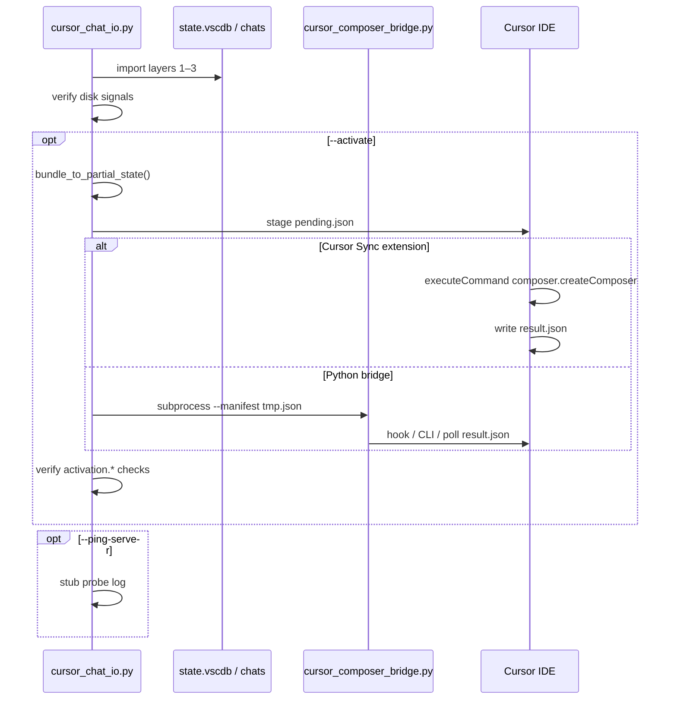

# Chat import IDE activation (import-v2)

**import-v2** splits work between bundled **transport-chat** Python scripts (disk) and **Cursor Sync** TypeScript (IDE). Starting in v0.7.0 the Python scripts ship inside the extension VSIX; no separate skill install is required.

| Phase | Owner | Scripts / code |
|-------|--------|----------------|
| Disk — transcripts, `store.db`, **`state.vscdb` merge** | **Bundled Python** | `<extensionPath>/resources/transport-chat/scripts/cursor_chat_io.py` |
| IDE — `composer.createComposer`, `pending.json`, `result.json` | **TypeScript** | `src/chat-import-activate.ts`, `src/chat-import-activate-watcher.ts` |

The extension does **not** write `state.vscdb` on bundle import; it always delegates to the bundled `cursor_chat_io.py import` via `src/chat-transport-scripts.ts:runPythonDiskImport`. Activation uses in-process `executeCommand` with `skipPythonBridge: true` (no Python IDE bridge inside the extension). Missing Python 3 or missing scripts now throw an actionable error pointing at `cursorSync.chatImport.pythonPath` / `cursorSync.chatImport.transportChatScriptDir`.

Headless agents can invoke the same scripts directly: `python3 <extensionPath>/resources/transport-chat/scripts/cursor_chat_io.py import --activate` runs disk in Python, stages `pending.json`, and relies on this extension's watcher for Phase B.

**Architecture:** [activation-architecture.md](../.cursor/plans/activation-architecture.md) (Option A — IDE bridge).

## End-to-end flow

```text
1. Disk restore (transport-chat Python — always for state.vscdb)
   python3 ~/.cursor/skills/transport-chat/scripts/cursor_chat_io.py import bundle.json \
     --workspace-folder /abs/path/to/repo

2. Disk verify
   store.db, global/workspace composerHeaders, workspaceIdentifier stamp

3. Activation (extension only when running in IDE)
   bundle_to_partial_state() → pending.json (CLI) or in-process createComposer
   Extension: executeCommand + result.json (skipPythonBridge)
   Headless: cursor_composer_bridge.py stages pending; watcher or hook completes

4. Optional server probe (cursorSync.chatImport.pingServer) — v1 stub

5. Post-activate verify
   pending.json, result.json composerId, activation.status
```



## Prerequisites

1. **Cursor is running** with the **target workspace folder** opened (same path as `import --workspace-folder`).
2. **Disk import** completes verify (store + sidebar) before activation runs.
3. Linux: `cursor` or `code` on `PATH`, or set `CURSOR_CLI` to the AppImage helper binary.

Without a running IDE, hook, or extension watcher, activation stages `pending.json` and the bridge exits **2** (import still succeeds unless `--activate-strict`).

## Extension (Cursor Sync)

Port plan: [port-chat-io-extension.plan.md](../.cursor/plans/port-chat-io-extension.plan.md).

When **Cursor Sync** is installed:

1. **Disk (Phase A)** — `restoreChatBundle` calls `runPythonDiskImport` → bundled `cursor_chat_io.py import` (no `--activate`). The TypeScript `mergeSidebarIntoStateDb` path is no longer used. When the bundle lacks `storeSnapshot`, Python `import` synthesizes `store.db` from `golden-chat-store.template.db` plus transcript JSONL.
2. **IDE (Phase B)** — `runPostImportActivation` with `skipPythonBridge: true`: `executeCommand('composer.createComposer', …)` and `result.json` only.
3. **`pending.json` watcher** — Completes CLI `import --activate` after Python stages the manifest.
4. **Headless** — Outside the extension, the bundled `cursor_composer_bridge.py` stages only (exit 2) or uses `CURSOR_COMPOSER_BRIDGE_COMMAND`.
5. **Progress events** — `restoreChatBundle` emits `onChatImportProgress` events (`phase: "A"|"B"`, `step`, `ok?`) that the sidebar Chats tab subscribes to for live Phase A/Phase B status.

### Extension commands

| Command | Description |
|---------|-------------|
| `cursorSync.importChatBundle` | Pick bundle JSON; disk restore; activation per settings below. |
| `cursorSync.importChatBundleActivate` | Same as import with `activate: true` (overrides `activateDefault` for that run). |
| `cursorSync.exportChatBundle` | Export current conversation to a bundle JSON. |
| `cursorSync.verifyChatImport` | Run disk + optional activation verify; report in Output channel. |
| `cursorSync.loadChatLocal` | Alias of import bundle (uses same `restoreChatBundle` path). |

Implementation: `src/chat-import-activate.ts`, `src/chat-import-activate-watcher.ts`, `src/chat-persistence.ts` (`restoreChatBundle`, `restoreOptionsFromConfiguration`).

## Import flags

### CLI (`cursor_chat_io.py`)

| Flag | Description |
|------|-------------|
| `--workspace-folder` | **Required.** Sets chats `store.db` key (md5) and stamps `workspaceIdentifier`. |
| `--activate` | After successful disk restore, build `partialState` and run activation (stage `pending.json`; bridge subprocess if extension does not confirm). |
| `--activate-strict` | Fail import if activation is staged only (exit **2** / no `result.json`). |
| `--bridge-wait-result SECONDS` | Poll `result.json` after staging (bridge `--wait-result`). |
| `--ping-server` | Optional probe stub (v1: logs only). |
| `--dry-run` | Skip writes; `[dry-run]` logs activation would-run steps. |
| `--no-global-state` | Skip global `state.vscdb` merge (not recommended). |

### Extension settings (`cursorSync.chatImport.*`)

| Setting | Type | Default | CLI equivalent | Description |
|---------|------|---------|----------------|-------------|
| `cursorSync.chatImport.activateDefault` | `boolean` | `false` | `--activate` | Run `composer.createComposer` after disk restore on bundle import. |
| `cursorSync.chatImport.activateStrict` | `boolean` | `false` | `--activate-strict` | Fail import if activation is staged only (no confirmed command or `result.json`). |
| `cursorSync.chatImport.bridgeWaitResultSeconds` | `number` | `0` | `--bridge-wait-result` | Seconds to poll `result.json` after staging (0 = no wait). |
| `cursorSync.chatImport.pingServer` | `boolean` | `false` | `--ping-server` | After activation, run agentClient probe stub (v1: logs only). |

### Example: full import-v2

```bash
SCRIPT="$(code --print-extension-path MarceloBarella.cursor-sync 2>/dev/null)/resources/transport-chat/scripts/cursor_chat_io.py"
# fallback: locate the VSIX install dir under ~/.cursor/extensions/marcelobarella.cursor-sync-*/resources/transport-chat/scripts/
python3 "$SCRIPT" import /tmp/chat-bundle.json \
  --workspace-folder /home/user/proj \
  --activate \
  --bridge-wait-result 30
```

Strict (fail if IDE did not confirm activation):

```bash
python3 "$SCRIPT" import /tmp/chat-bundle.json \
  --workspace-folder /home/user/proj \
  --activate --activate-strict
```

Post-check only (after manual activation or extension wrote `result.json`):

```bash
python3 "$SCRIPT" verify \
  --bundle /tmp/chat-bundle.json \
  --workspace-folder /home/user/proj \
  --post-activate
```

## Manifest schema (bridge input)

Written to a temp file by `cursor_chat_io.py`, or manually for `cursor_composer_bridge.py`.

| Field | Type | Required | Description |
|-------|------|----------|-------------|
| `partialState` | object | yes | `createComposer` payload from `bundle_to_partial_state()` |
| `workspaceFolder` | string | yes | Absolute workspace path (must match opened folder) |
| `openInNewTab` | boolean | no (default `true`) | Passed into `createComposerOptions` |
| `createComposerOptions` | object | no | Extra options: `view`, `targetGroup`, etc. |

`partialState` must include `composerId` (same as bundle `conversationId`). Do not include stripped runtime fields (`agentSessionId`, `capabilities`, `conversationActionManager`).

### Example manifest (minimal)

```json
{
  "partialState": {
    "composerId": "43aae2fb-71fc-4e9c-9add-3e995caaaa80",
    "name": "Orchestrator chat",
    "type": "head",
    "unifiedMode": "agent",
    "forceMode": "edit",
    "createdAt": 1779369862871,
    "lastUpdatedAt": 1779369862871,
    "lastOpenedAt": 1779369862871,
    "workspaceIdentifier": {
      "id": "f038a5d2e2e5594b5e779064d4feac57",
      "uri": {
        "$mid": 1,
        "fsPath": "/home/user/proj",
        "_sep": 47,
        "external": "file:///home/user/proj",
        "path": "/home/user/proj",
        "scheme": "file"
      }
    }
  },
  "workspaceFolder": "/home/user/proj",
  "openInNewTab": true
}
```

## Staged manifest (bridge output on disk)

Written atomically to:

`~/.cursor/import-activation/pending.json`

Enriched fields:

| Field | Description |
|-------|-------------|
| `version` | `1` |
| `composerId` | From `partialState.composerId` |
| `commandId` | `composer.createComposer` |
| `stagedAt` | UTC ISO timestamp |
| `createComposerOptions` | `{ "openInNewTab": true, "view": "editor" }` plus overrides |

With **Cursor Sync** installed, `src/chat-import-activate-watcher.ts` watches this file and calls `executeCommand('composer.createComposer', …)` when `workspaceFolder` matches an open folder.

## Running the bridge (standalone)

```bash
python3 scripts/cursor_composer_bridge.py --manifest /tmp/activate.json
```

Or pipe JSON:

```bash
python3 scripts/cursor_composer_bridge.py < /tmp/activate.json
```

Optional:

- `--wait-result 30` — poll `~/.cursor/import-activation/result.json` for up to 30s after staging.
- `--no-focus` — skip `cursor -r <workspaceFolder>` focus attempt.

### Environment

| Variable | Purpose |
|----------|---------|
| `CURSOR_CLI` | Path to `cursor` binary when not on `PATH` |
| `CURSOR_COMPOSER_BRIDGE_COMMAND` | Shell command hook; must print `{"composerId":"<uuid>"}` on stdout on success |

Hook receives env: `CURSOR_IMPORT_MANIFEST`, `CURSOR_IMPORT_COMPOSER_ID`, `CURSOR_IMPORT_WORKSPACE`.

### Result file (extension / manual)

`~/.cursor/import-activation/result.json`:

```json
{"ok": true, "composerId": "43aae2fb-71fc-4e9c-9add-3e995caaaa80"}
```

Use with `--bridge-wait-result` on import or `--wait-result` on the bridge after something in the IDE writes this file.

## Bridge exit codes and import behavior

| Bridge exit | Meaning | Default import (`--activate`) | `--activate-strict` |
|-------------|---------|-------------------------------|---------------------|
| `0` | Activation confirmed (hook, CLI, or `result.json`) | Success | Success |
| `1` | Invalid manifest / bridge error | **Fail import** | **Fail import** |
| `2` | Manifest staged only | Warning, import OK | **Fail import** |

## Verify: disk + activation

**Disk checks** (always on import): `store.db`, `global.composerHeaders`, `workspaceIdentifier`, optional `composerData`.

**Activation checks** (with `--activate` on import or `verify --post-activate`):

| Check | OK | PENDING | WARN / SKIP |
|-------|-----|---------|-------------|
| `activation.pending` | `pending.json` matches `conversationId` | — | wrong/missing id |
| `activation.result` | `result.json` composerId matches | no `result.json` yet | mismatch / unreadable |
| `activation.status` | completed | staged, not confirmed | no artifacts |

RequestID is **not** produced by the bridge; it appears after the first agent turn in the IDE.

## Success and failure signals

### Bridge success (exit 0)

**Stdout** (single JSON line):

```json
{"composerId":"43aae2fb-71fc-4e9c-9add-3e995caaaa80"}
```

Sources (first match wins):

1. `CURSOR_COMPOSER_BRIDGE_COMMAND` stdout JSON
2. `cursor --command` / `--execute-command` if listed in `cursor --help` (not available on Cursor 3.5.x today)
3. `result.json` when `--wait-result` / `--bridge-wait-result` is set

### Bridge failure

| Exit | Meaning |
|------|---------|
| `1` | Invalid manifest or unreadable input |
| `2` | Manifest staged; no activation path (stderr explains `pending.json` path) |

**Stderr** always logs human-readable errors; never put errors only on stdout.

## Limitations (v1)

- Stock Cursor CLI has no `executeCommand`; use the extension or `CURSOR_COMPOSER_BRIDGE_COMMAND` hook.
- `--ping-server` is a stub until `agentClient` Connect-RPC contract is documented.
- RequestID appears after first agent turn in IDE, not from bridge stdout.
- Cross-machine import may need `deepCloneComposer`-equivalent blob remap (v2).
- `xdotool` / DBus palette automation intentionally not used (fragile).

## Related files

| File | Role |
|------|------|
| `src/chat-import-activate.ts` | Stage `pending.json`, `executeCommand`, `result.json`, bridge fallback |
| `src/chat-import-activate-watcher.ts` | `pending.json` FileSystemWatcher |
| `src/chat-persistence.ts` | `restoreChatBundle` import-v2 orchestration |
| `~/.cursor/skills/transport-chat/scripts/cursor_composer_bridge.py` | Headless staging / hook (not IDE) |
| `~/.cursor/skills/transport-chat/scripts/cursor_chat_io.py` | Disk import, `state.vscdb`, `bundle_to_partial_state()` |
| `src/chat-transport-scripts.ts` | Resolve skill scripts; spawn disk `import` |
| `.cursor/plans/port-chat-io-extension.plan.md` | Extension port plan and parity todos |
| `.cursor/plans/partial-state-mapping.md` | Field mapping |
| `.cursor/plans/activation-architecture.md` | Strategy and decision matrix |
| `.cursor/plans/discovery-notes-activation.md` | `composer.createComposer` evidence |
