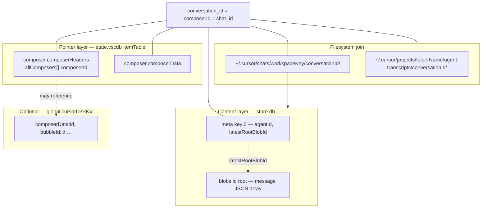
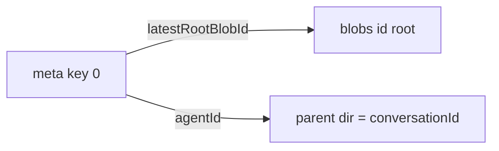
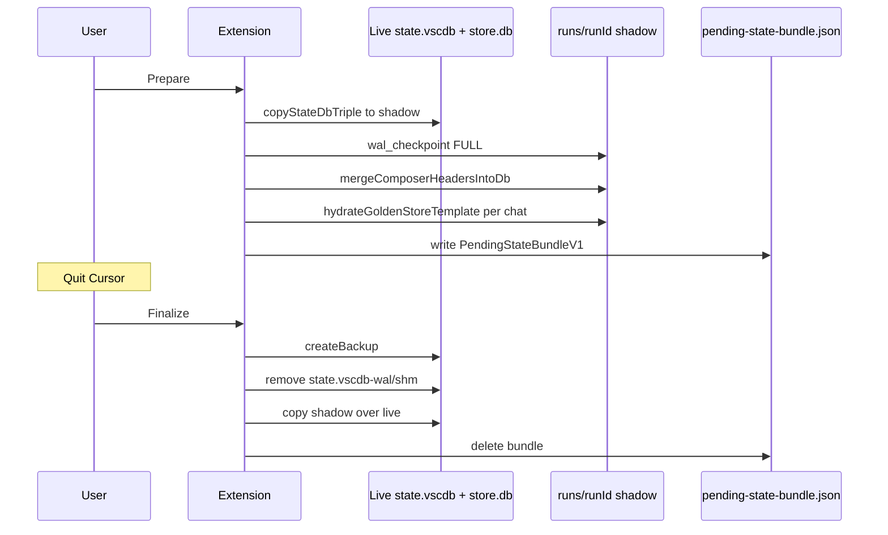

# Cursor chat persistence — reference

Authoritative merge of reverse-engineering for Cursor Agent chat persistence on disk. Covers per-chat `store.db`, VS Code `state.vscdb` composer/sidebar keys, workspace identifiers, and extension backup/restore behavior.

**Evidence basis:** Golden SQLite templates, Cursor Sync extension source (`src/chat-persistence.ts`, `src/state-reconciliation.ts`, `src/transcripts.ts`, `src/composer-merge.ts`, `src/chat-id-sync.ts`, `src/store-template-hydrate.ts`, `src/sync-engine-ops.ts`), and unit tests. **Live gap:** Research VMs had no `~/.cursor/chats/**/store.db` or `~/.config/Cursor/**/state.vscdb`; live Cursor encryption, extra `meta`/`blobs` keys, and canonical `composer.composerData` shape are flagged under [Open unknowns](#open-unknowns). Run the [Live verification commands](#live-verification-commands) on a machine with Agent history before treating inventories as complete.

**Hypothesis (partially supported):** Sidebar/composer state in `state.vscdb` is the pointer layer; `store.db` holds message bodies; both must agree on `composerId` / `conversation_id` and `workspaceKey`. Byte-identical full-file backup/restore can revive chats across Cursor versions **only if** ID schemes, table layouts, and WAL handling stay compatible—not guaranteed after upgrades.

---

## Architecture overview

Cursor Agent chat persistence spans four cooperating layers:

| Layer | Role | Primary path (Linux) |
|-------|------|----------------------|
| **Chats store** | Per-conversation SQLite message DB | `~/.cursor/chats/<workspaceKey>/<conversationId>/store.db` |
| **Composer state** | Sidebar list + per-composer metadata | `~/.config/Cursor/User/globalStorage/state.vscdb` or `workspaceStorage/<folderId>/state.vscdb` |
| **Global KV (Cursor)** | Large session/bubble payloads (read-only in extension) | `cursorDiskKV` in global `state.vscdb` |
| **Agent transcripts** | JSONL export/import parallel tree | `~/.cursor/projects/<folderName>/agent-transcripts/<conversationId>/` |

The Cursor Sync extension treats `store.db` as an **opaque SQLite file** (base64 in bundles) or hydrates a **golden template** (`PRAGMA user_version = 1`, `meta` + `blobs` only). It **writes** only two `ItemTable` keys in `state.vscdb` (`composer.composerHeaders`, `composer.composerData`) via JSON merge or full-file replace; it does **not** sync `cursorDiskKV` or `bubbleId:*` keys.



**Operational model:** Visible sidebar threads need aligned **pointer** (headers, often data) + **content** (`store.db`) + usually **transcripts** for export fidelity. Restoring headers alone may list a thread without messages; restoring `store.db` alone may leave the thread invisible.

---

## Live paths

| Layer | Linux path | Notes |
|-------|------------|--------|
| Chats root | `~/.cursor/chats/` | `resolveChatsRoot()` |
| Per chat | `~/.cursor/chats/<workspaceKey>/<conversationId>/store.db` | Parent dir name = UUID |
| Global state | `~/.config/Cursor/User/globalStorage/state.vscdb` | + `-wal`, `-shm` |
| Workspace state | `~/.config/Cursor/User/workspaceStorage/<workspaceStorageFolderId>/state.vscdb` | `workspace.json` sibling |
| Transcripts | `~/.cursor/projects/<folderName>/agent-transcripts/<conversationId>/` | Separate namespace from `workspaceKey` |
| Sidecar metadata | `.../agent-transcripts/<id>/cursor-sidebar-metadata.json` | Not in SQLite |
| Extension backups | `<extension globalStorage>/backups/<timestamp>/` | Max 3 dirs; rollback on failed writes |
| Pending reconciliation | `<extension globalStorage>/state-reconciliation/runs/<runId>/` | Shadow copies |

macOS: `~/Library/Application Support/Cursor/User/...`. Windows: `%APPDATA%/Cursor/User/...`.

---

## Join keys

### Primary invariant

**`composerId` === `conversation_id` === `chat_id` === chats folder name === `meta.agentId` (after hydrate)**

Extension enforces this for import validation (`src/chat-id-sync.ts`). `workspaceKey` must exist under `~/.cursor/chats/` when that tree is non-empty (`validateWorkspaceKeysForImport`).

### Cross-layer mapping table

| Identifier | Location | Joins to |
|------------|----------|----------|
| `conversation_id` / `composerId` | Manifests, paths, `meta.agentId`, headers | UUID across all layers |
| `workspaceKey` | `~/.cursor/chats/<workspaceKey>/` | Groups stores; **not** equal to `workspaceStorageFolderId` or project `folderName` (not proven) |
| `workspaceStorageFolderId` | `workspaceStorage/<id>/` | Selects workspace-scoped `state.vscdb` when `stateTarget: "workspace"` |
| `projectKey` / `folderName` | `~/.cursor/projects/<folderName>/` | Transcripts only; import may map store to `folderName` as convenience |
| `workspaceIdentifier.id` | Inside header JSON | `md5(open workspace fsPath)` — sidebar filter for open folder; not chats path |

### Identifier independence (do not conflate)

| Pair | Relationship |
|------|----------------|
| `workspaceKey` ↔ `workspaceStorageFolderId` | Separate manifest fields; extension never assumes equality |
| `workspaceKey` ↔ project `folderName` | UI states chats hash is **not** project folder name; `deriveStoreWorkspaceMapping` still defaults to `folderName` when unambiguous |
| `workspaceKey` ↔ `md5(fsPath)` | Not used for chats paths; md5 only in `workspaceIdentifier` JSON |

`findStoreDbForConversation` scans **all** `workspaceKey` directories lexicographically; duplicate `conversationId` under different keys → first hit wins (ambiguous).

---

## `store.db` schema

Per-conversation SQLite under `~/.cursor/chats/<workspaceKey>/<conversationId>/store.db`.

### Layout (golden template + extension)

| Setting | Value |
|---------|--------|
| `PRAGMA user_version` | `1` (`GOLDEN_STORE_TEMPLATE_VERSION`) |
| `PRAGMA journal_mode` | `wal` |
| Tables | `meta`, `blobs` only |

```sql
CREATE TABLE meta (key TEXT PRIMARY KEY, value BLOB NOT NULL);
CREATE TABLE blobs (id TEXT PRIMARY KEY, value BLOB NOT NULL);
```

### `meta` table

| Key | Value | Fields |
|-----|-------|--------|
| `'0'` | UTF-8 JSON in BLOB | `agentId`, `latestRootBlobId`, `name`, `mode`, `createdAt` |

- `agentId`: set to `conversationId` on hydrate.
- `latestRootBlobId`: points to `blobs.id` (golden: `"root"`).
- `mode`: extension always writes `"default"`.

Other `meta` keys: not in golden or extension code; live Cursor may add more.

### `blobs` table

| `id` | Value | Shape |
|------|-------|--------|
| `'root'` | JSON array as BLOB | `[{ "role": "user"\|"assistant"\|"tool", "content": [{ "type": "text", "text": "..." }] }]` |

Extension-supported graph: one meta row (`'0'`) + one blob (`'root'`). Export fixture `store-snapshot.json` describes multi-blob `blob-*` chains—that is a **conceptual** fidelity target, not confirmed on-disk in the golden DB.

### Blob graph



### WAL / sidecars

Golden uses WAL. Extension **finalize** replaces `store.db` main file only—does **not** remove `store.db-wal` / `store.db-shm` (unlike `state.vscdb` finalize). Stale WAL after ad-hoc copy while Cursor was open is a corruption risk.

### Versioning

Bump requires `golden-store-template.sql`, regenerate `golden-chat-store.template.db`, and `GOLDEN_STORE_TEMPLATE_VERSION` (`resources/README-golden.txt`). `assertTemplateLayout` fails if `user_version !== 1` or tables missing.

---

## `state.vscdb` keys

VS Code SQLite holding the **sidebar pointer layer**. WAL sidecars: `state.vscdb-wal`, `state.vscdb-shm`.

### Tables

**`ItemTable`** (extension read/write for composer):

```sql
CREATE TABLE ItemTable (key TEXT PRIMARY KEY, value TEXT);
```

**`cursorDiskKV`** (extension read-only on export):

| Key pattern | Role (community / Cursor ~0.50.5) |
|-------------|-----------------------------------|
| `composerData:{composerId}` | Full session metadata |
| `bubbleId:{composerId}:{bubbleId}` | Individual bubbles |
| Other | `codeBlockDiff`, `agentKv`, … |

Restoring `ItemTable` composer keys alone may **not** revive full message history if bodies live in `cursorDiskKV` and/or `store.db`.

### Extension-written `ItemTable` keys

| Key | Purpose |
|-----|---------|
| `composer.composerHeaders` | Sidebar thread list |
| `composer.composerData` | Heavier per-composer state (optional on some paths) |

### `composer.composerHeaders` shape

```json
{
  "allComposers": [{
    "type": "head",
    "composerId": "<uuid>",
    "name": "<title>",
    "subtitle": "<string>",
    "lastUpdatedAt": 1731539400000,
    "lastOpenedAt": 1731539400000,
    "createdAt": 1731539400000,
    "workspaceIdentifier": { "id": "<md5(fsPath)>", "uri": { ... } }
  }]
}
```

| Field | Requirement |
|-------|-------------|
| `type` | Must be `"head"` or Cursor ignores entry; extension backfills |
| `composerId` | Join key to `conversation_id` |
| Timestamps | Extension may use epoch ms (numbers) or ISO strings depending on path |

### `composer.composerData` shapes

1. **Map:** top-level keys are composer UUIDs (or preserved stable keys).
2. **Array:** `{ "allComposers": [ { "composerId", ... } ] }` — `filterComposerDataPayload` keeps matching entries.

Canonical shape for current Cursor builds: **unknown** without live DB.

### Merge semantics (extension)

| Operation | Behavior |
|-----------|----------|
| Headers | `mergeComposerHeadersAdditive`: merge `allComposers` by `composerId`, shallow merge per row; ensure `type: "head"` |
| Data | `mergeComposerDataAdditive`: add missing keys; merge arrays by `composerId`; **do not** overwrite scalar conflicts |
| State reconciliation shadow | Headers only (unless `metadata_overrides.state_vscdb_sql`) |
| Import DB order | `resolveImportMergeStateDbCandidates`: **global first**, then workspace |
| Save/read order | `resolveStateDbCandidates`: **workspace first**, then global |

Operators should set `stateTarget` consistently and record `workspaceStorageFolderId` for workspace scope.

### Global vs workspace `stateTarget`

| `stateTarget` | Live path |
|---------------|-----------|
| `"global"` | `globalStorage/state.vscdb` |
| `"workspace"` | `workspaceStorage/<workspaceStorageFolderId>/state.vscdb` |

Manifest fields: `chats-manifest` `stateTarget` + `workspaceStorageFolderId`; `sync-manifest` `state_target` + `workspace_storage_folder_id`. **`workspaceKey` in manifests refers to `~/.cursor/chats/`, not workspaceStorage folder id.**

### WAL handling (state)

| Phase | Behavior |
|-------|----------|
| Prepare shadow | `copyStateDbTriple` (main + wal + shm); `PRAGMA wal_checkpoint(FULL)` on shadow |
| Finalize live | Backup live; **delete** live `-wal` and `-shm`; copy shadow main over live; `replaceFileWithRetries` (5×, 400ms backoff) |

---

## Workspace mapping

### Discovery (extension)

| Function | Behavior |
|----------|----------|
| `listWorkspaceKeysUnderChatsRoot` | `readdir` of `~/.cursor/chats/` |
| `validateWorkspaceKeysForImport` | Every manifest `workspace_key` must exist (strict if chats dirs exist) |
| `findStoreDbForConversation` | Scan all workspace keys for `<conversationId>/store.db` |
| `deriveStoreWorkspaceMapping` | Map `sourceWorkspaceKey` → target project **`folderName`** when unambiguous; else user prompt |

**Import risk:** Auto-map to `folderName` is a sync convenience, not proof Cursor names chats dirs that way. Prefer picking an existing name from `listChatsWorkspaceKeys`.

### How keys are created (repo evidence)

| Key | Algorithm in extension |
|-----|------------------------|
| `workspaceKey` | **Unknown** — opaque; Cursor creates when Agent chat is used |
| `workspaceStorageFolderId` | VS Code workspace storage (not reimplemented) |
| `folderName` (projects) | Encoded path + optional hash suffix (`discoverProjects`) |
| `workspaceIdentifier.id` | `md5(fsPath)` of first workspace folder |
| `conversation_id` | UUID v4 |

### Live correlation procedure

On a machine with Cursor installed:

1. `ls ~/.cursor/chats/` → candidate `workspaceKey` values.
2. For each `workspaceStorage/*/workspace.json`, read folder URI/path.
3. Compare to `~/.cursor/projects/` names.
4. Test whether `workspaceKey` equals workspaceStorage id, `md5(uri)`, or project `folderName` (often **none**).

---

## Encrypted vs plaintext

| Data | Location | Extension treatment | Live unknown |
|------|----------|---------------------|--------------|
| `meta.value`, `blobs.value` | `store.db` BLOB columns | Plaintext UTF-8 JSON via `CAST(... AS BLOB)`; no decrypt in repo | Cursor could encrypt in future builds |
| Whole `store.db` | Filesystem | Standard SQLite (not SQLCipher in golden) | File-level encryption not ruled out |
| `ItemTable` composer keys | `state.vscdb` | Plaintext JSON TEXT; `JSON.parse` / escaped SQL literals | Binary/encrypted values would break merge |
| `cursorDiskKV` | Global `state.vscdb` | Read-only evidence; truncated in UI (`coerceSqliteValue` 4000 chars); full read via `parseFullJsonValue` for dedicated SELECTs | Not written on import |
| Chat bundle | JSON | Base64 wrap of raw `store.db` bytes; checksum over decoded bytes | N/A |

**Verifier check (live):**

```bash
sqlite3 ~/.cursor/chats/*/*/store.db \
  "SELECT key, substr(CAST(value AS TEXT),1,80) FROM meta;"
```

If `CAST(value AS TEXT)` is not valid UTF-8 JSON, treat as encrypted or binary-encoded.

Golden template hex prefix `7B226167656E744964...` decodes to `{"agentId"...` (plaintext JSON in BLOB).

---

## Safe sync and restore constraints

### Before you restore

1. **Quit Cursor completely** (all windows) before finalize pending reconciliation or full `state.vscdb` replace.
2. **Map `workspaceKey` explicitly** — use an existing `~/.cursor/chats/*` directory name; do not invent keys. Record `sourceWorkspaceKey` on export (v2 requires it for store restore).
3. **Align join keys** — `composerId` === conversation folder name === `meta.agentId`; headers need `type: "head"`.
4. **Restore all layers** for visible Agent chat: `store.db` + `composer.composerHeaders` (and usually `composer.composerData`) + transcripts where used.
5. **Verify checksums** on bundle/gist artifacts; extension skips mismatched bytes.
6. **Reload window** after sidebar merge if threads do not appear.

### Safe operations

| Do | Why |
|----|-----|
| Use Prepare → quit Cursor → Finalize for manifest/sync imports | Shadow merge avoids touching live DBs; finalize strips state WAL/SHM |
| Prefer pending-state-bundle over ad-hoc file copies | Atomic intent for state + listed stores; backup + rollback on finalize failure |
| Use additive composer merge while Cursor is open | Safer for sidebar-only updates; creates extension backup before overwrite |
| Validate `workspace_key` against disk before import | Wrong key → store on disk but invisible in UI |
| Set `stateTarget` + `workspaceStorageFolderId` consistently | Wrong workspace DB → wrong sidebar |
| Rely on checksum-valid opaque `store.db` bytes | Integrity check (not schema compatibility) |

### Unsafe operations

| Do not | Why |
|--------|-----|
| Copy `store.db` only | Stale/missing sidebar pointers |
| Merge sidebar only | Headers without message blobs |
| Replace `state.vscdb` while Cursor is running | Locks, corruption, partial WAL |
| Copy `state.vscdb` main without WAL checkpoint / triple | Incomplete snapshot |
| Leave stale `store.db-wal` / `-shm` after main-file replace | Inconsistent reads |
| Assume `workspaceKey` === workspaceStorage folder id | Different namespaces |
| Blind restore across major Cursor upgrade | Schema / encryption / key drift |
| Use golden template hydration for faithful history | Best-effort reconstruction, not byte-accurate backup |
| Edit composer JSON manually | Duplicates, invalid sidebar |
| Expect extension UI “restore from backup” | Only automatic rollback on failed writes (last 3 backup dirs) |

### Cross-version full-file restore verdict

**Partially supported** when:

- `PRAGMA user_version` and `meta`/`blobs` / ItemTable JSON layouts unchanged.
- IDs stable (`composerId`, `workspaceKey`, folder names).
- WAL consistent (quit Cursor; state finalize deletes WAL/SHM; avoid stale store WAL).
- All layers consistent.

**Not guaranteed:** Checksum proves byte fidelity, not that Cursor still parses after upgrade. `goldenStoreTemplateVersion` recorded in pending bundles does not enforce runtime Cursor version.

### Pending-state-bundle flow (recommended multi-file restore)



`PendingStateBundleV1`: `stateVscdbLive`, `stateVscdbShadow`, `storeReplacements[]`, `goldenStoreTemplateVersion`, `runId`, `createdAt`. On finalize failure: `rollbackFromBackup`; quit Cursor and retry.

### Backup surfaces (extension)

| Surface | Capture |
|---------|---------|
| `ChatBundle` | Base64 `store.db`, sidebar snapshot, transcript files + checksums |
| Pending run shadow | Full state triple + per-chat shadow `store.db` |
| `globalStorage/backups/` | Pre-overwrite copies (max 3 timestamps) |

---

## Open unknowns

Consolidated from explore workers and verifiers (live validation pending):

1. **`workspaceKey` formula** — opaque; relation to workspace URI, workspaceStorage id, or machine id unknown.
2. **Live `meta` keys beyond `'0'`** and **multi-blob chains** (`blob-*` ids) in production `store.db`.
3. **Rich message schema** in live blobs (tool, reasoning, attachments) vs extension’s simplified text parts.
4. **`cursorDiskKV` vs `ItemTable` vs `store.db`** division across Cursor versions; extension does not sync KV/bubbles.
5. **Authoritative `stateTarget` at runtime** — global vs workspace vs both; save vs import candidate order differs.
6. **Canonical `composer.composerData` shape** (map vs `allComposers` array) for current Cursor.
7. **Encryption at rest** in live Cursor DBs (golden + extension paths are plaintext JSON).
8. **`store.db` WAL on finalize** — main-file replace without WAL/SHM cleanup.
9. **Duplicate `conversationId` across `workspaceKey` dirs** — lexicographic first match.
10. **`deriveStoreWorkspaceMapping` using `folderName`** vs disk-discovered `workspaceKey`.
11. **`PRAGMA user_version` / migrations** for `state.vscdb` — not handled in extension.
12. **Other `ItemTable` keys** referencing a conversation — not merged on import.

---

## Live verification commands

Run on a host with Cursor Agent history (not available on research VMs).

**store.db:**

```bash
find ~/.cursor/chats -name store.db | head -5
sqlite3 PATH/store.db "PRAGMA user_version; PRAGMA journal_mode; SELECT name FROM sqlite_master WHERE type='table';"
sqlite3 PATH/store.db "SELECT key FROM meta; SELECT id FROM blobs;"
sqlite3 PATH/store.db "SELECT key, substr(CAST(value AS TEXT),1,120) FROM meta;"
```

**state.vscdb:**

```bash
sqlite3 ~/.config/Cursor/User/globalStorage/state.vscdb ".tables"
sqlite3 ~/.config/Cursor/User/globalStorage/state.vscdb \
  "SELECT key, length(value) FROM ItemTable WHERE key LIKE 'composer.%';"
sqlite3 ~/.config/Cursor/User/globalStorage/state.vscdb \
  "SELECT key FROM cursorDiskKV LIMIT 20;"
```

**Workspace correlation:**

```bash
ls ~/.cursor/chats/
ls ~/.config/Cursor/User/workspaceStorage/*/workspace.json
```

---

## Repo sources

| Module | Topics |
|--------|--------|
| `src/store-template-hydrate.ts` | Golden template, `meta`/`blobs` hydrate |
| `src/chat-persistence.ts` | Chat bundle save/load |
| `src/state-reconciliation.ts` | Pending bundle prepare/finalize |
| `src/rollback.ts` | Backup / rollback (max 3) |
| `src/transcripts.ts` | Export/import, workspace mapping, evidence queries |
| `src/composer-merge.ts` | Header/data merge, `type: "head"` |
| `src/chat-id-sync.ts` | `composerId` / `workspace_key` invariants |
| `src/sync-engine-ops.ts` | State DB paths, WAL triple, checkpoint |
| `src/chats-manifest.ts`, `src/sync-manifest.ts` | `stateTarget`, `workspaceStorageFolderId` |
| `resources/golden-store-template.sql`, `golden-chat-store.template.db` | Canonical `store.db` layout |

Detailed slice docs (orchestration artifacts): `.orchestrate/cursor-chat-persistence/docs/explore-store-db.md`, `explore-state-vscdb.md`, `explore-workspace-mapping.md`, `explore-restore-risks.md`.
