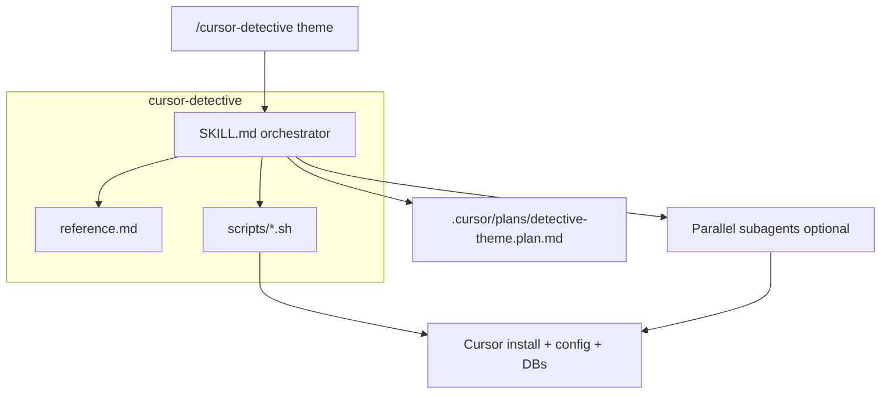

# cursor-detective — design spec

**Date:** 2026-05-25  
**Status:** Draft for review  
**Install target:** `~/.cursor/skills/cursor-detective/` (personal skill)

## Summary

`cursor-detective` is a read-only investigation skill that deep-scans Cursor’s local install, configuration, SQLite stores, workbench bundles, and project artifacts. It generalizes the methodology from four prior agent threads (transported chat load failures, tool/MCP UI gaps, orchestrated persistence RE, sidebar/unravel flow) into one **generic pipeline** plus **bundled helper scripts**.

Output: `.cursor/plans/detective-<theme>.plan.md` in the **current workspace**.

Invocation: explicit only — `/cursor-detective [theme]` with `disable-model-invocation: true`.

## Goals

- Forensically map how Cursor behaves on disk and in bundled JS for **any** user-supplied theme (not chat-only).
- Produce evidence-tiered reports (Confirmed / Inferred / Unknown).
- Delegate broad parallel probes; use scripts for repeatable, low-drift checks.
- Stay read-only on Cursor and user data (except writing the plan file in the open repo).

## Non-goals (v1)

- Named playbooks or modes (chat lessons live in `reference.md` as examples only).
- Auto-invocation without `/cursor-detective`.
- Export/import or fixes (defer to `transport-chat`, `debugger`).
- Project-scoped skill copy under `cursor-sync` (personal install only).
- Commits unless the user explicitly requests them.

## User decisions (locked)

| Topic | Choice |
|--------|--------|
| Location | Personal: `~/.cursor/skills/cursor-detective/` |
| Report | `.cursor/plans/detective-<theme>.plan.md` in current workspace |
| Invocation | Explicit only |
| Structure | Generic framework; chat as examples in `reference.md` |
| Packaging | **Orchestrator + `reference.md` + bundled `scripts/`** |

## Architecture



### Components

| Unit | Responsibility |
|------|----------------|
| `SKILL.md` | Phases, delegation rules, evidence model, report template, when to run which script |
| `reference.md` | Platform paths, SQLite table notes, workbench grep patterns, condensed chat-investigation examples |
| `scripts/` | Read-only probes; stdout JSON or markdown-friendly text for agent citation |

## Investigation pipeline

### Phase 1 — Frame

- Normalize **theme** (trim, lowercase, hyphenate; fallback `general-scan` if empty).
- Set output path: `.cursor/plans/detective-<theme>.plan.md`.
- Restate objective, scope boundaries, and success criteria in one short paragraph.
- List testable assumptions and unknowns.

### Phase 2 — Discover (scripts + light shell)

Run in order (stop early if a step fails with clear error in report):

1. `scripts/locate-cursor.sh` — install roots, AppImage, workbench bundle path, version hints.
2. `scripts/scan-paths.sh` — existence/size summary of standard data dirs (`~/.cursor`, `~/.config/Cursor`, workspaceStorage).

### Phase 3 — Delegate (optional, parallel)

Launch up to four subagents when theme is broad or compare targets are provided:

| Agent | Scope |
|-------|--------|
| Install/bundle | AppImage/squashfs, `workbench.desktop.main.js`, keyword grep |
| State DBs | `state.vscdb` ItemTable + `cursorDiskKV` sampling |
| Project artifacts | `~/.cursor/projects/**`, transcripts, chats `store.db` |
| Compare | User-supplied UUIDs/paths (broken vs working) |

Subagents must cite script output and raw paths; no speculation without tag.

### Phase 4 — Extract (scripts by theme)

| Theme signal | Scripts |
|--------------|---------|
| Persistence / storage | `inspect-state-vscdb.sh`, `inspect-store-db.sh` |
| UI / composer / sidebar | `grep-workbench.sh` |
| A vs B on-disk | `compare-dirs.sh` or `compare-sqlite-meta.sh` |
| Full inventory | all inspect scripts with limits |

### Phase 5 — Synthesize

Write `detective-<theme>.plan.md` using the report template (below). Include mermaid diagram when data-flow is in scope.

## Evidence model

| Tag | Meaning |
|-----|---------|
| **Confirmed** | Script output or file path + snippet |
| **Inferred** | Pattern in bundle/schema without runtime proof |
| **Unknown** | Probe ran; no evidence; document what was tried |

Forbidden: inventing storage keys, API names, or file paths not seen in probes.

## Report template

Required sections (in order):

1. **Objective** — theme and success criteria  
2. **Environment** — OS, paths from `locate-cursor.sh`, Cursor channel/version if detected  
3. **Scan checklist** — table of probes run (script name, exit code, brief result)  
4. **Findings** — grouped by subsystem; each bullet tagged Confirmed/Inferred/Unknown  
5. **Diagram** — mermaid flow/architecture when persistence or UI pipeline is relevant  
6. **Gaps & follow-ups** — next probes or experiments  
7. **Workspace relevance** — optional note if findings touch the open repo (e.g. cursor-sync transport)

## Bundled scripts (v1)

All scripts: `bash`, `set -euo pipefail`, read-only, safe to run without args (sensible defaults) or with `--help`. Prefer JSON lines or key=value blocks for agent parsing.

| Script | Purpose | Default behavior |
|--------|---------|------------------|
| `locate-cursor.sh` | Find install dir, AppImage, main workbench JS | Search `~/Applications/cursor`, `/usr/share/cursor*`, `/opt/Cursor`, `~/.local/share/cursor`; print best `WORKBENCH_JS` |
| `scan-paths.sh` | Inventory standard Cursor data locations | List exists/size/mtime for `~/.cursor`, config User dir, `globalStorage/state.vscdb`, `projects/`, `chats/` |
| `inspect-state-vscdb.sh` | Sample global/workspace `state.vscdb` | `--db PATH`; table list; counts for `ItemTable` composer keys; sample `cursorDiskKV` key prefixes; optional `--composer-id UUID` |
| `inspect-store-db.sh` | Schema + row counts for one `store.db` | `--db PATH`; `.schema`, `meta` keys, blob count; warn if not Merkle-style schema |
| `grep-workbench.sh` | Search minified bundle for patterns | `--pattern REGEX` or built-in set (`toolFormerData`, `composerData`, `cursorDiskKV`, `store.db`); `--file PATH` override |
| `compare-sqlite-meta.sh` | Diff two SQLite DBs at metadata level | `--a PATH --b PATH`; schema diff, table row counts, not full BLOB compare |
| `compare-dirs.sh` | Shallow compare two directories | `--a DIR --b DIR`; file list + size diff (for transcript folders or chat UUID dirs) |

### Script contract

- Exit `0` on success; non-zero with stderr message on missing paths.
- Never write into `~/.cursor` or `~/.config/Cursor` except via the agent writing the workspace plan file.
- No `sudo`. No network.
- Cap output: truncate large grep (e.g. first 20 hits) and document truncation in stdout header.

### Agent usage rule

Run scripts **before** claiming Confirmed findings. Paste or summarize script output in the plan under **Scan checklist** and cite in **Findings**.

## SKILL.md frontmatter (draft)

```yaml
---
name: cursor-detective
description: >-
  Deep read-only forensics on Cursor local install, config, SQLite state,
  workbench bundles, and project artifacts via bundled scripts and parallel
  probes. Writes .cursor/plans/detective-<theme>.plan.md. Use when the user
  invokes /cursor-detective or asks to reverse-engineer Cursor internals,
  scan state.vscdb, inspect AppImage/workbench, or compare on-disk behavior.
disable-model-invocation: true
---
```

## reference.md contents (outline)

- Linux/macOS/Windows path table (config, globalStorage, projects, chats)
- `state.vscdb`: `ItemTable` vs `cursorDiskKV` roles
- Workbench: typical bundle path under install root
- **Examples (not playbooks):** four-layer chat model; IDE reads `cursorDiskKV` for UI; `store.db` often CLI-side; JSONL transcripts archival
- Keyword list for `grep-workbench.sh` defaults
- Pointers to cursor-sync docs when workspace is cursor-sync (optional cross-link)

## Relationship to other skills

| Skill | When to use instead |
|-------|---------------------|
| `transport-chat` | User wants export/import/run transport |
| `unravel` | User wants flow narrative only, already knows paths |
| `research` | Question is about open repo code, not Cursor product |
| `debugger` | User has a repro and wants a fix |

## Implementation plan (after spec approval)

1. Create `~/.cursor/skills/cursor-detective/SKILL.md` from this spec.
2. Create `reference.md` with path table and chat examples.
3. Implement `scripts/*.sh` with `--help` and tests via manual smoke run on Linux.
4. Smoke: `/cursor-detective cursor-storage-inventory` in cursor-sync workspace; verify plan file created.
5. Do **not** commit cursor-sync design doc unless user asks (per AGENTS.md: avoid staging `docs/` unless requested).

## Spec self-review

| Check | Result |
|-------|--------|
| Placeholders / TBD | None |
| Internal consistency | Scripts align with pipeline phases |
| Scope | Single skill + scripts; no playbooks |
| Ambiguity | Theme normalization matches unravel; explicit-only invocation stated |
| User constraints | Personal skill, workspace plan output, generic framework |

## Open questions for implementation

- Whether `inspect-state-vscdb.sh` should default to global DB only or accept `--workspace-storage-id`.
- macOS/Windows path branches in `locate-cursor.sh` (implement in v1 or Linux-only with Assumption tags).
