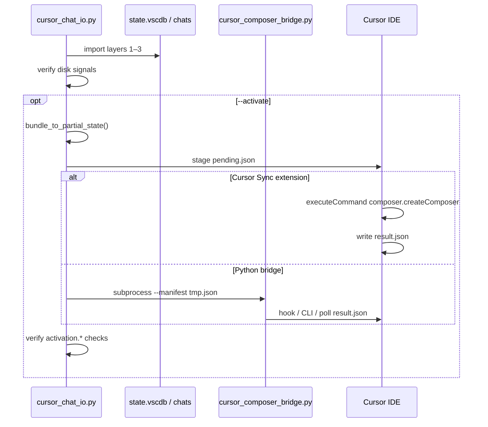

# Chat import IDE activation (import-v2)

**import-v2** = Phase A (disk) + Phase B (IDE) + verify.

| Phase | Owner |
|-------|--------|
| Disk — transcripts, `store.db`, **`state.vscdb` merge** | **transport-chat** — `cursor_chat_io.py import` (no `--activate`) |
| IDE — `composer.createComposer`, `result.json` | **Cursor Sync** extension only |

Python must not call `executeCommand`. The bridge in this skill **stages** `pending.json` for headless `import --activate`; **Cursor Sync** runs `composer.createComposer` and writes `result.json`.

**Skill scripts:**

```bash
CHAT_IO="${HOME}/.cursor/skills/transport-chat/scripts/cursor_chat_io.py"
BRIDGE="${HOME}/.cursor/skills/transport-chat/scripts/cursor_composer_bridge.py"
```

## End-to-end flow

```text
1. Disk restore (Phase A — Cursor quit recommended)
   python3 "$CHAT_IO" import bundle.json \
     --workspace-folder /abs/path/to/dest \
     --target-project <dest-project-key> \
     --state-db <dest-workspace-state.vscdb>

2. Disk verify
   store.db, global/workspace composerHeaders, workspaceIdentifier stamp

   If the bundle has no `storeSnapshot`, `import` copies
   `resources/golden-chat-store.template.db`, hydrates meta/blobs from transcript JSONL,
   and writes `~/.cursor/chats/<md5(folder)>/<uuid>/store.db`.

3. Activation (Phase B — Cursor open on dest)
   bundle_to_partial_state() → pending.json
   Cursor Sync extension: executeCommand + result.json
   Else: cursor_composer_bridge.py (may stage only)

4. Post-activate verify
   python3 "$CHAT_IO" verify ... --post-activate
```



## Prerequisites

1. **Phase B:** Cursor is **running** with the **target workspace folder** opened (same path as `import --workspace-folder`).
2. **Phase A:** Disk import verify (store + sidebar) should pass before activation.
3. **Cursor Sync** enabled, or `CURSOR_COMPOSER_BRIDGE_COMMAND`, or manual `result.json`.
4. Linux: `cursor` or `code` on `PATH`, or `CURSOR_CLI` to the AppImage binary.

Without a running IDE, hook, or extension watcher, activation stages `pending.json` and the bridge exits **2** (import still succeeds unless `--activate-strict`).

## Extension (Cursor Sync)

IDE bridge only — **no `state.vscdb` writes** on import (`restoreChatBundle` delegates disk to `cursor_chat_io.py` when the transport-chat skill is installed).

1. **Disk** — spawns `~/.cursor/skills/transport-chat/scripts/cursor_chat_io.py import` (Phase A).
2. **Activation** — `executeCommand('composer.createComposer', …)` with `skipPythonBridge` (no bridge subprocess inside the extension).
3. **`pending.json` watcher** — completes activation for CLI `import --activate` after Python stages the manifest.
4. **Headless fallback** — `CURSOR_COMPOSER_BRIDGE_COMMAND` or bridge exit 2 when the extension is not running.

### Extension commands

| Command | Description |
|---------|-------------|
| `cursorSync.importChatBundle` | Pick bundle; disk restore; activation per settings |
| `cursorSync.importChatBundleActivate` | Same with `activate: true` |
| `cursorSync.exportChatBundle` | Export current conversation to bundle JSON |
| `cursorSync.verifyChatImport` | Disk + optional activation verify |
| `cursorSync.loadChatLocal` | Alias of import bundle |

Source: [cursor-sync](https://github.com/Marcelo-Barella/cursor-sync) `src/chat-import-activate.ts`, `src/chat-import-activate-watcher.ts`, `src/chat-persistence.ts`.

## Import flags (CLI)

| Flag | Description |
|------|-------------|
| `--workspace-folder` | **Required.** Sets chats `store.db` key (md5) and stamps `workspaceIdentifier`. |
| `--activate` | After disk restore, build `partialState` and run activation. |
| `--activate-strict` | Fail import if activation is staged only (exit **2** / no `result.json`). |
| `--bridge-wait-result SECONDS` | Poll `result.json` after staging. |
| `--post-activate` | On `verify`, include activation checks. |
| `--no-global-state` | Skip global `state.vscdb` merge (not recommended). |

### Example: full import-v2

```bash
python3 "$CHAT_IO" import /tmp/chat-bundle.json \
  --workspace-folder /home/user/proj \
  --target-project home-user-proj \
  --state-db ~/.config/Cursor/User/workspaceStorage/<id>/state.vscdb \
  --activate \
  --bridge-wait-result 30
```

Strict:

```bash
python3 "$CHAT_IO" import /tmp/chat-bundle.json \
  --workspace-folder /home/user/proj \
  --activate --activate-strict
```

Post-check only:

```bash
python3 "$CHAT_IO" verify \
  --conversation-id <uuid> \
  --workspace-folder /home/user/proj \
  --post-activate
```

## Manifest schema (bridge input)

| Field | Type | Required | Description |
|-------|------|----------|-------------|
| `partialState` | object | yes | `createComposer` payload from `bundle_to_partial_state()` |
| `workspaceFolder` | string | yes | Absolute workspace path (must match opened folder) |
| `openInNewTab` | boolean | no (default `true`) | Passed into `createComposerOptions` |
| `createComposerOptions` | object | no | Extra options: `view`, `targetGroup`, etc. |

`partialState` must include `composerId` (same as bundle `conversationId`). Do not include stripped runtime fields (`agentSessionId`, `capabilities`, `conversationActionManager`).

### Example manifest (minimal)

```json
{
  "partialState": {
    "composerId": "43aae2fb-71fc-4e9c-9add-3e995caaaa80",
    "name": "Imported chat",
    "type": "head",
    "unifiedMode": "agent",
    "forceMode": "edit",
    "createdAt": 1779369862871,
    "lastUpdatedAt": 1779369862871,
    "lastOpenedAt": 1779369862871,
    "workspaceIdentifier": {
      "id": "<workspaceStorageId>",
      "uri": {
        "$mid": 1,
        "fsPath": "/home/user/proj",
        "_sep": 47,
        "external": "file:///home/user/proj",
        "path": "/home/user/proj",
        "scheme": "file"
      }
    }
  },
  "workspaceFolder": "/home/user/proj",
  "openInNewTab": true
}
```

## Staged manifest (on disk)

`~/.cursor/import-activation/pending.json`

| Field | Description |
|-------|-------------|
| `version` | `1` |
| `composerId` | From `partialState.composerId` |
| `commandId` | `composer.createComposer` |
| `stagedAt` | UTC ISO timestamp |
| `createComposerOptions` | `{ "openInNewTab": true, "view": "editor" }` plus overrides |

## Running the bridge (standalone)

```bash
python3 "$BRIDGE" --manifest /tmp/activate.json --wait-result 30
```

### Environment

| Variable | Purpose |
|----------|---------|
| `CURSOR_CLI` | Path to `cursor` binary when not on `PATH` |
| `CURSOR_COMPOSER_BRIDGE_COMMAND` | Shell hook; stdout `{"composerId":"<uuid>"}` on success |

Hook env: `CURSOR_IMPORT_MANIFEST`, `CURSOR_IMPORT_COMPOSER_ID`, `CURSOR_IMPORT_WORKSPACE`.

### Result file

`~/.cursor/import-activation/result.json`:

```json
{"ok": true, "composerId": "43aae2fb-71fc-4e9c-9add-3e995caaaa80"}
```

## Bridge exit codes

| Exit | Meaning | Default `--activate` | `--activate-strict` |
|------|---------|----------------------|---------------------|
| `0` | Activation confirmed | Success | Success |
| `1` | Invalid manifest / error | Fail import | Fail import |
| `2` | Staged only | Warning, import OK | Fail import |

## Verify: disk + activation

**Disk:** `store.db`, `global.composerHeaders`, `workspaceIdentifier`, optional `composerData[<uuid>]`.

**Activation:**

| Check | OK | PENDING |
|-------|-----|---------|
| `activation.pending` | `pending.json` matches UUID | — |
| `activation.result` | `result.json` composerId matches | no `result.json` yet |
| `activation.status` | completed | staged, not confirmed |

## Limitations (v1)

- Stock Cursor CLI has no `executeCommand`; use Cursor Sync or `CURSOR_COMPOSER_BRIDGE_COMMAND`.
- `--ping-server` is a stub.
- Cross-workspace / cross-machine import may need `store.db` blob remap (v2); v1 copies blobs as-is.
- Export without source `composer.composerHeaders` row → synthesized sidebar; weaker activation payload.

## Related

| Location | Role |
|----------|------|
| `~/.cursor/skills/transport-chat/SKILL.md` | Agent workflow (two phases) |
| `~/.cursor/skills/transport-chat/scripts/cursor_chat_io.py` | Disk import, verify, orchestration |
| `~/.cursor/skills/transport-chat/scripts/cursor_composer_bridge.py` | Bridge entrypoint |
| [cursor-sync](https://github.com/Marcelo-Barella/cursor-sync) | Extension source of truth |
